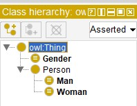
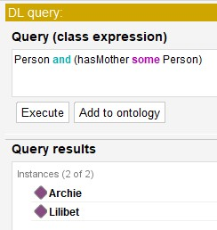
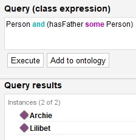
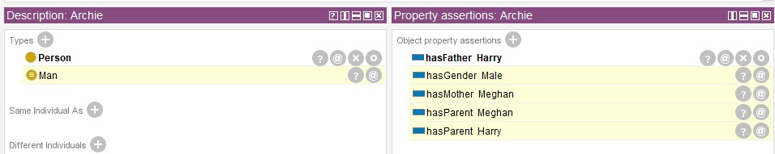
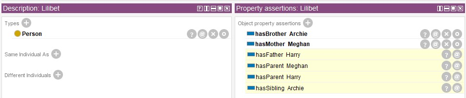

### Ontologia Genealógica



### Hierarquia de Classes para `Person`

As fontes fornecem informações sobre a hierarquia de classes relacionadas à classe `Person`.

* A ontologia define quatro classes principais relacionadas a indivíduos: `Gender`, `Man`, `Person` e `Woman`.
* **`Person` está no topo dessa hierarquia**. É a classe mais geral, abrangendo qualquer indivíduo sem especificar o gênero.
* **`Man` e `Woman` são subclasses de `Person`**. Isso significa que toda instância de `Man` ou `Woman` também é considerada uma instância de `Person`.
* A classe `Gender` representa o conceito de gênero e está vinculada a `Person` por meio da propriedade de objeto `hasGender`.
* `Gender` é definida como tendo duas possíveis instâncias: `Female` e `Male`.
* `Man` é especificamente definido como um `Person` cujo gênero é `Male`, e `Woman` é definida como um `Person` cujo gênero é `Female`.

Portanto, a hierarquia de classes pode ser visualizada da seguinte forma:

```
      Person
       / \
      /   \
     Man   Woman
```

Essa hierarquia indica que tanto `Man` quanto `Woman` herdam as características e relações associadas à classe `Person`, além de possuírem atributos específicos relacionados ao gênero.

---

## TBox na Ontologia Fornecida

O arquivo de ontologia fornecido ("Genealogia_01.owl") define vários componentes que constituem sua TBox (caixa terminológica). A TBox foca na definição do vocabulário e dos conceitos dentro de um domínio de conhecimento. No caso, o domínio é genealogia, e a TBox estabelece as relações e restrições relacionadas aos laços familiares.

### Componentes da TBox:

* **Classes:** Representam categorias ou tipos de entidades. A ontologia define as seguintes classes:
  * `Gender`: Representa o conceito de gênero. É definido como tendo dois possíveis valores: `Female` e `Male`.
  * `Man`: Representa o conceito de homem. É definido como um `Person` cujo gênero é `Male`.
  * `Person`: A classe mais geral, que representa qualquer indivíduo.
  * `Woman`: Representa o conceito de mulher. É definida como um `Person` cujo gênero é `Female`.

* **Propriedades de Objeto:** Representam relações entre indivíduos. A ontologia define várias relações familiares como propriedades de objeto:
  * `hasBrother`: Conecta um `Person` ao seu irmão (`Man`). Essa propriedade é uma subpropriedade de `hasSibling`.
  * `hasFather`: Conecta um `Person` ao seu pai (`Man`). É uma subpropriedade de `hasParent` e inclui um axioma de cadeia de propriedades.
  * `hasGender`: Conecta um `Person` ao seu `Gender`.
  * `hasMother`: Conecta um `Person` à sua mãe (`Woman`). É uma subpropriedade de `hasParent` e inclui um axioma de cadeia de propriedades.
  * `hasParent`: Conecta um `Person` a qualquer um de seus pais (`Person`).
  * `hasSibling`: Conecta um `Person` a qualquer um de seus irmãos (`Person`).
  * `hasSister`: Conecta um `Person` à sua irmã (`Woman`). Essa propriedade é uma subpropriedade de `hasSibling`.

* **Axiomas de Cadeia de Propriedades:** Esses axiomas definem relações inferidas com base em relações existentes. São expressos usando a construção `owl:propertyChainAxiom`. A ontologia inclui dois axiomas de cadeia de propriedades que codificam regras de inferência:

  * Axioma para `hasFather`: Declara que, se um indivíduo *x* tem um irmão *y*, e *y* tem um pai *f*, então *x* também tem pai *f*. Isso é expresso em DL como `hasBrother o hasFather -> hasFather`.
  * Axioma para `hasMother`: Declara que, se um indivíduo *x* tem um irmão *y*, e *x* tem uma mãe *m*, então *y* também tem mãe *m*. Isso é representado em DL usando o inverso da propriedade `hasBrother`.

* **Propriedades de Anotação:** Fornecem informações adicionais sobre elementos na ontologia. A ontologia usa uma propriedade de anotação:
  * `DASE_RULE`: Utilizada para anotar axiomas de cadeia de propriedades com representações legíveis para humanos das regras de inferência que codificam.

Em resumo, a TBox na ontologia fornecida define um vocabulário e uma estrutura para representar e raciocinar sobre informações genealógicas. Ela prepara o terreno para a inclusão de indivíduos específicos e seus relacionamentos, que fariam parte da ABox (caixa de assertivas).

---

## Regras de Inferência na Ontologia

A ontologia codifica duas regras de inferência, expressas como axiomas de cadeia de propriedades e anotadas com a propriedade de anotação `DASE_RULE`.

* **R1:** `hasBrother(?x, ?y) ^ hasMother(?x, ?m) -> hasMother(?y, ?m)`
  * Essa regra declara que, se uma pessoa *x* tem um irmão *y* e *x* tem uma mãe *m*, então *y* também tem a mesma mãe *m*.

* **R3:** `hasBrother(?x, ?y) ^ hasFather(?y, ?f) -> hasFather(?x, ?f)`
  * Essa regra declara que, se uma pessoa *x* tem um irmão *y* e *y* tem um pai *f*, então *x* também tem o mesmo pai *f*.

Essas regras permitem inferências lógicas baseadas em relações explícitas definidas na ontologia.

---

### Exemplo: Inferindo Relacionamentos Maternos com a Regra R1



A Regra R1 (`hasBrother(?x, ?y) ^ hasMother(?x, ?m) -> hasMother(?y, ?m)`) permite inferir um relacionamento mãe-filho com base na relação entre irmãos e na mãe de um deles. Aqui está como funciona:

1. **`hasBrother(?x, ?y)`**: Verifica se existe uma relação de irmão (`hasBrother`) entre dois indivíduos, *x* e *y*.
2. **`hasMother(?x, ?m)`**: Verifica se o indivíduo *x* tem uma relação de mãe (`hasMother`) com outro indivíduo *m*.
3. **`-> hasMother(?y, ?m)`**: Se ambas as condições anteriores forem verdadeiras, infere que *y* também tem a mesma mãe *m*.

#### Exemplo concreto:

* Sabemos que Lilibet tem um irmão chamado Archie:  
  `:Lilibet rdf:type owl:NamedIndividual , :Person ; :hasBrother :Archie ;`.
* Sabemos também que Lilibet tem uma mãe chamada Meghan:  
  `:Lilibet rdf:type owl:NamedIndividual , :Person ; :hasBrother :Archie ; :hasMother :Meghan .`.

### Aplicando R1:

*   *x* corresponde a Lilibet.
*   *y* corresponde a Archie.
*   *m* corresponde a Meghan.

Como Lilibet tem um irmão chamado Archie, e Lilibet tem uma mãe chamada Meghan, a Regra R1 permite inferir que **Archie também tem Meghan como sua mãe**. Essa inferência é derivada mesmo que o fato de Meghan ser a mãe de Archie não seja explicitamente declarado nas fontes.

Portanto, a R1 utiliza as relações existentes entre irmãos e mãe-filho para deduzir a conexão materna para o outro irmão, demonstrando as capacidades de raciocínio da ontologia.

---

### Inferindo Paternidade com a Regra R3



A Regra R3, representada como `hasBrother(?x, ?y) ^ hasFather(?y, ?f) -> hasFather(?x, ?f)`, se concentra em inferir o pai de um indivíduo com base na relação de irmandade e no pai de seu irmão. Aqui está uma explicação detalhada de como a R3 funciona:

*   **`hasBrother(?x, ?y)`**: Este componente verifica se existe uma relação de 'irmão' (`hasBrother`) entre os indivíduos *x* e *y*, indicando que *x* tem um irmão *y*.

*   **`hasFather(?y, ?f)`**: Esta parte verifica a existência de uma relação de 'pai' (`hasFather`) entre *y* (o irmão) e outro indivíduo, *f*, confirmando que *f* é o pai de *y*.

*   **`-> hasFather(?x, ?f)`**: Este é o resultado derivado da regra. Se ambas as condições mencionadas acima forem verdadeiras (isto é, *x* tem um irmão *y*, e *y* tem um pai *f*), a regra deduz que *x* também compartilha o mesmo pai *f*.

---

### Aplicando R3 a um Cenário Específico

*   Sabemos que Lilibet tem um irmão chamado Archie: `:Lilibet rdf:type owl:NamedIndividual , :Person ; :hasBrother :Archie ;`.
*   Também sabemos que Archie tem um pai chamado Harry: `:Archie rdf:type owl:NamedIndividual , :Person ; :hasFather :Harry .`.

Mapeando essa informação para a R3:

*   *x* corresponde a Lilibet.
*   *y* corresponde a Archie.
*   *f* corresponde a Harry.

Dado que Lilibet tem um irmão chamado Archie, e Archie tem um pai chamado Harry, podemos usar a R3 para concluir que **Lilibet também tem Harry como seu pai**. Essa inferência é possível mesmo que o fato de Harry ser o pai de Lilibet não esteja diretamente declarado nas fontes.

Em essência, a R3 utiliza a relação existente de irmãos e o pai de um deles para inferir o vínculo paterno para o outro irmão. Isso exemplifica as capacidades de raciocínio facilitadas pela ontologia, permitindo a descoberta de novos conhecimentos por meio de inferências lógicas.

### Inferências Gerais Baseadas em Definições de Classes e Propriedades

* Podemos inferir que todo `Man` é um `Person` porque `Man` é definido como uma subclasse de `Person` na ontologia.
* Da mesma forma, toda `Woman` também é um `Person`.
* Se sabemos que um indivíduo está relacionado a outro por meio de `hasBrother`, podemos inferir que eles também estão relacionados por meio de `hasSibling`, pois `hasBrother` é uma subpropriedade de `hasSibling`.
* A mesma lógica se aplica a `hasSister`, que é uma subpropriedade de `hasSibling`.

Esses exemplos ilustram como a ontologia possibilita o raciocínio e a derivação de novos conhecimentos com base nos axiomas e relacionamentos definidos. Combinando os fatos explícitos declarados na ontologia com as regras de inferência, um sistema pode inferir informações adicionais sobre os indivíduos e suas conexões familiares.

---

### Declarações sobre Archie



#### Declarações Explícitas

- Archie **hasFather**: Harry

---

### Relacionamentos Inferidos

#### **Classe `Man`**
- **Relacionamento `hasBrother`**:
  - Lilibet tem um irmão, Archie (`hasBrother`).
  - `hasBrother` está relacionado à classe `Man`.

#### **Propriedade `hasGender: Male`**
- **Relacionamento `hasBrother`**:
  - Lilibet tem um irmão, Archie (`hasBrother`).
  - `hasBrother` está relacionado à classe `Man`.
  - `Man` é equivalente a (`Person` e `hasGender` com valor `Male`).

#### **Propriedade `hasMother: Meghan`**
- **Relacionamentos Inferidos**:
  - Lilibet tem um irmão, Archie.
  - Lilibet tem uma mãe, Meghan.
- **Inferência de Subpropriedade**:
  - `inverse(hasBrother) o hasMother` é uma subpropriedade de `hasMother`.

#### **Propriedade `hasParent: Meghan`**
- **Relacionamentos Inferidos**:
  - Lilibet tem um irmão, Archie.
  - Lilibet tem uma mãe, Meghan.
- **Inferência de Subpropriedade**:
  - `inverse(hasBrother) o hasMother` é uma subpropriedade de `hasMother`.
  - `hasMother` é uma subpropriedade de `hasParent`.

#### **Propriedade `hasParent: Harry`**
- **Relacionamentos Inferidos**:
  - Archie tem um pai, Harry.
  - `hasFather` é uma subpropriedade de `hasParent`.

---

### Explicação da Expressão

#### **`inverse(hasBrother) o hasMother SubPropertyOf hasMother`**

##### Componentes-Chave

1. **`inverse(hasBrother)`**:
   - Refere-se ao inverso da propriedade `hasBrother`.
   - Se `hasBrother(X, Y)` significa "X tem Y como irmão", então `inverse(hasBrother)(Y, X)` significa "Y é o irmão de X".

2. **`o` (Operador de Composição)**:
   - O operador de composição indica que duas propriedades são combinadas sequencialmente.
   - Para duas propriedades `P` e `Q`, `P o Q` significa: "Se existe um relacionamento `P(A, B)` e um relacionamento `Q(B, C)`, então existe um relacionamento composto entre `A` e `C`."

3. **`SubPropertyOf`**:
   - Indica que o relacionamento composto é uma subpropriedade de outra propriedade, neste caso, `hasMother`.
   - Se `P o Q SubPropertyOf R`, então todo relacionamento derivado de `P o Q` também é válido sob `R`.

---

### O Que a Regra Significa

1. **Lógica de Composição**:
   - `inverse(hasBrother) o hasMother` significa:
     1. Comece com uma pessoa `Y` que tem um irmão `X` (relacionamento `inverse(hasBrother)`).
     2. Verifique quem é a mãe de `X` (relacionamento `hasMother`).
     3. Como resultado, infira que a mãe de `X` também é a mãe de `Y`.

2. **Regra de Inferência**:
   - Se **Pessoa Y** é o irmão de **Pessoa X**, e **Pessoa X** tem uma mãe **M**, então **Pessoa Y** também tem **M** como sua mãe.

---

### Exemplo

- **Dado**:
  - `hasBrother(John, Mark)`: "John tem Mark como irmão."
  - `hasMother(Mark, Mary)`: "Mark tem Mary como mãe."

- **Inferido**:
  - Pela regra, `inverse(hasBrother)(Mark, John) o hasMother(Mark, Mary)` permite inferir:
    - `hasMother(John, Mary)`: "John também tem Mary como sua mãe."

---

### Uso Prático

Essa regra ajuda a propagar relações familiares logicamente:

1. Garante que as relações maternas sejam consistentes entre irmãos.
2. Formaliza a suposição de que irmãos compartilham a mesma mãe, permitindo raciocínio automatizado em uma ontologia genealógica.

### Declarações sobre Lilibet



---

### Declarações Diretas

- **`hasBrother`**: Archie  
- **`hasMother`**: Meghan  

---

### Relacionamentos Inferidos

#### **1. `hasFather`: Harry**
- **Raciocínio**:
  - Archie possui o relacionamento `hasFather` com Harry.
  - Lilibet possui o relacionamento `hasBrother` com Archie. De acordo com a regra:
    - **`hasBrother o hasFather SubPropertyOf hasFather`**
      - Se uma pessoa tem um irmão e esse irmão tem um pai, a pessoa também compartilha o mesmo pai.
  - Portanto, inferimos que **Lilibet também possui Harry como pai**.

#### **2. `hasParent`: Meghan**
- **Raciocínio**:
  - Lilibet possui o relacionamento `hasMother` com Meghan.
  - De acordo com a regra:
    - **`hasMother SubPropertyOf hasParent`**
      - Uma mãe é um tipo de pai (no sentido genérico de parentalidade).
  - Assim, inferimos que **Lilibet também possui Meghan como um de seus pais**.

#### **3. `hasParent`: Harry**
- **Raciocínio**:
  - Lilibet possui o relacionamento `hasFather` com Harry.
  - De acordo com a regra:
    - **`hasFather SubPropertyOf hasParent`**
      - Um pai é um tipo de parentalidade.
  - Assim, inferimos que **Lilibet também possui Harry como um de seus pais**.

#### **4. `hasSibling`: Archie**
- **Raciocínio**:
  - Lilibet possui o relacionamento `hasBrother` com Archie.
  - De acordo com a regra:
    - **`hasBrother SubPropertyOf hasSibling`**
      - Um irmão é um tipo de irmão/irmã (sibling).
  - Portanto, inferimos que **Archie também é um irmão de Lilibet no contexto geral de irmãos**.

---

### Explicação das Regras

#### **`hasBrother o hasFather SubPropertyOf hasFather`**

##### Componentes-Chave:

1. **`hasBrother`**: Representa uma relação de irmandade entre duas pessoas.
2. **`hasFather`**: Representa uma relação paternal entre uma pessoa e seu pai.
3. **`o` (operador de composição)**:
   - Se `hasBrother(A, B)` e `hasFather(B, C)` forem verdadeiros, então podemos inferir `hasFather(A, C)`.

---

##### Exemplo:

- **Dado**:
  - `hasBrother(Lilibet, Archie)` (Lilibet tem Archie como irmão).
  - `hasFather(Archie, Harry)` (Archie tem Harry como pai).
  
- **Inferência**:
  - Pela regra de composição, inferimos que:
    - **`hasFather(Lilibet, Harry)`** (Lilibet também tem Harry como pai).

Essa regra demonstra como informações parciais podem ser combinadas para deduzir relacionamentos adicionais, aproveitando a estrutura lógica da ontologia para automatizar o raciocínio sobre dados familiares.