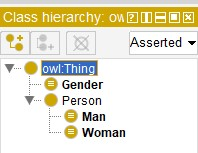
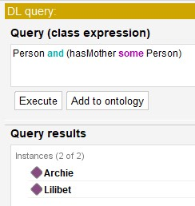
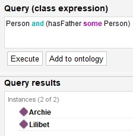
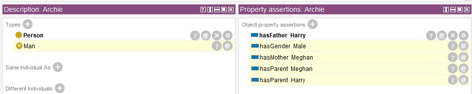

# Genealogy Ontology



### Class Hierarchy for `Person`

The sources provide information about the class hierarchy related to `Person`. 

*   The ontology defines four main classes related to individuals: `Gender`, `Man`, `Person`, and `Woman`.
*   **`Person` sits at the top of this hierarchy**. It is the most general class, encompassing any individual without specifying their gender.
*   **`Man` and `Woman` are subclasses of `Person`**. This means that every instance of `Man` or `Woman` is also considered an instance of `Person`. 
*   The `Gender` class represents the concept of gender and is linked to `Person` through the `hasGender` object property. 
*   `Gender` is further defined as having two possible instances: `Female` and `Male`.
*   `Man` is specifically defined as a `Person` whose gender is `Male`, and `Woman` is defined as a `Person` whose gender is `Female`.

Therefore, the class hierarchy can be visualized as follows:

```
      Person
       / \
      /   \
     Man   Woman
```

This hierarchy indicates that both `Man` and `Woman` inherit the characteristics and relationships associated with the `Person` class, while also having their specific attributes related to their gender. 

## TBox in the Provided Ontology

The provided ontology file ("Genealogia_01.owl") defines several components that constitute its TBox (terminological box). The TBox focuses on defining the vocabulary and concepts within a knowledge domain. In this case, the domain is genealogy, and the TBox establishes the relationships and constraints related to familial ties.

Here's a breakdown of the TBox components:

*   **Classes:** These represent categories or types of entities. The ontology defines the following classes:
    *   `Gender`: Represents the concept of gender. It is defined as having two possible values: `Female` and `Male`.
    *   `Man`: Represents the concept of a man. It is defined as a `Person` whose gender is `Male`.
    *   `Person`: The most general class representing any individual.
    *   `Woman`: Represents the concept of a woman. It is defined as a `Person` whose gender is `Female`.

*   **Object Properties:** These represent relationships between individuals. The ontology defines several familial relationships as object properties:
    *   `hasBrother`: Connects a `Person` to their male sibling (`Man`). This property is a sub-property of `hasSibling`.
    *   `hasFather`: Connects a `Person` to their male parent (`Man`). It is a sub-property of `hasParent` and includes a property chain axiom.
    *   `hasGender`: Connects a `Person` to their `Gender`.
    *   `hasMother`: Connects a `Person` to their female parent (`Woman`). It is a sub-property of `hasParent` and includes a property chain axiom.
    *   `hasParent`:  Connects a `Person` to any of their parents (`Person`).
    *   `hasSibling`: Connects a `Person` to any of their siblings (`Person`).
    *   `hasSister`: Connects a `Person` to their female sibling (`Woman`). This property is a sub-property of `hasSibling`.

*   **Property Chain Axioms:** These axioms define inferred relationships based on existing ones. They are expressed using the `owl:propertyChainAxiom` construct. The provided ontology includes two property chain axioms, which encode the inference rules:

    *   Axiom for `hasFather`: It states that if an individual *x* has a brother *y*, and *y* has a father *f*, then *x* also has father *f*. This is expressed in DL as `hasBrother o hasFather -> hasFather`.
    *   Axiom for `hasMother`: It states that if individual *x* has a brother *y*, and *x* has a mother *m*, then *y* also has mother *m*. This is represented in DL using the inverse of the `hasBrother` property.

*   **Annotation Properties:** These provide additional information about elements in the ontology. The ontology uses one annotation property:
    *   `DASE_RULE`: Used to annotate property chain axioms with human-readable representations of the inference rules they encode.

In essence, the TBox in the provided ontology defines a vocabulary and structure for representing and reasoning about genealogical information. It lays the groundwork for populating the ontology with specific individuals and their relationships, which would be part of the ABox (assertional box).


The ontology encodes two inference rules, which are expressed as property chain axioms and annotated with the `DASE_RULE` annotation property.

*   **R1:** `hasBrother(?x, ?y) ^ hasMother(?x, ?m) -> hasMother(?y, ?m)`

    This rule states that if person *x* has a brother *y* and person *x* has a mother *m*, then person *y* also has mother *m*.
*   **R3:** `hasBrother(?x, ?y) ^ hasFather(?y, ?f) -> hasFather(?x, ?f)`

    This rule states that if person *x* has a brother *y* and person *y* has a father *f*, then person *x* also has father *f*.


The inference rules are mapped to Description Logic (DL) using **property chain axioms**.

*   In DL, a property chain axiom allows you to infer the existence of a relationship between two individuals based on the existence of a chain of relationships between them. For example, the property chain axiom `hasBrother o hasFather -> hasFather` states that if an individual *x* has a brother *y*, and *y* has a father *f*, then *x* also has father *f*.

*   The rules **R1** and **R3** are represented in the ontology using this mechanism. The `owl:propertyChainAxiom` construct is used to define the chain of properties, and the `DASE_RULE` annotation property is used to provide a human-readable representation of the rule.

Let's examine the DL mapping for **R1**:

*   **R1 in DASE:** `hasBrother(?x, ?y) ^ hasMother(?x, ?m) -> hasMother(?y, ?m)`
*   **R1 in DL:** The `owl:annotatedTarget` for `hasMother` includes `[ owl:inverseOf :hasBrother ]` followed by `:hasMother`. This signifies that if you traverse the inverse relationship of `hasBrother` from individual *y*, then follow the `hasMother` relationship, it implies that individual *y* also has the same `hasMother` relationship.

The DL mapping for **R3** follows a similar pattern:

*   **R3 in DASE:** `hasBrother(?x, ?y) ^ hasFather(?y, ?f) -> hasFather(?x, ?f)`
*   **R3 in DL:** The `owl:annotatedTarget` for `hasFather` includes `:hasBrother` followed by `:hasFather`. This indicates that starting from individual *x*, traversing the `hasBrother` relationship to *y*, and then following the `hasFather` relationship leads to the inference that individual *x* also shares the same `hasFather` relationship.

## Inferences Possible in the Ontology

Several inferences can be made using the defined classes, object properties, and particularly, the property chain axioms in this ontology. These axioms allow the system to deduce new knowledge based on existing facts. Let's explore some potential inferences:

## Inferring Motherhood Using Rule R1



Rule R1, expressed as `hasBrother(?x, ?y) ^ hasMother(?x, ?m) -> hasMother(?y, ?m)`, enables the inference of a mother-child relationship based on the sibling relationship and the mother of one sibling. Let's break down how this works:

*   **`hasBrother(?x, ?y)`**: This part of the rule checks if there is a 'hasBrother' relationship between two individuals, let's call them *x* and *y*. In simpler terms, it checks if *x* has a brother *y*.

*   **`hasMother(?x, ?m)`**:  This part checks if individual *x* has a 'hasMother' relationship with another individual, *m*. This means it verifies if *m* is the mother of *x*.

*   **`-> hasMother(?y, ?m)`**: This is the consequence of the rule. If both the preceding conditions are true (i.e., *x* has a brother *y*, and *x* has a mother *m*), then the rule infers that *y* also has the same mother *m*.

Let's look at a concrete example from the sources to illustrate this:

*   We know that Lilibet has a brother named Archie: `:Lilibet rdf:type owl:NamedIndividual , :Person ; :hasBrother :Archie ;`.
*   We also know that Lilibet has a mother named Meghan: `:Lilibet rdf:type owl:NamedIndividual , :Person ; :hasBrother :Archie ; :hasMother :Meghan .`.

Applying R1:

*   *x* corresponds to Lilibet.
*   *y* corresponds to Archie.
*   *m* corresponds to Meghan.

Since Lilibet has a brother Archie, and Lilibet has a mother Meghan, R1 allows us to infer that **Archie also has Meghan as his mother**. This inference is derived even though the fact that Archie's mother is Meghan is not explicitly stated in the sources.

Therefore, R1 leverages the existing sibling and mother-child relationships to deduce the maternal connection for the other sibling, demonstrating the reasoning capabilities of the ontology.


## Inferring Fatherhood via Rule R3




Rule R3, represented as `hasBrother(?x, ?y) ^ hasFather(?y, ?f) -> hasFather(?x, ?f)`, focuses on inferring the father of an individual based on their sibling relationship and the father of their sibling. Here's a detailed explanation of how R3 works:

*   **`hasBrother(?x, ?y)`:**  This component verifies if there exists a 'hasBrother' relationship between individuals *x* and *y*, signifying that *x* has a brother *y*.

*   **`hasFather(?y, ?f)`:** This part checks for the existence of a 'hasFather' relationship between *y* (the brother) and another individual, *f*, confirming that *f* is the father of *y*.

*   **`-> hasFather(?x, ?f)`:**  This represents the result derived from the rule. If both the conditions mentioned above hold true (i.e., *x* has a brother *y*, and *y* has a father *f*), the rule deduces that *x* also shares the same father *f*.

Now, let's apply R3 to a specific scenario from the provided sources:

*   We know that Lilibet has a brother named Archie: `:Lilibet rdf:type owl:NamedIndividual , :Person ; :hasBrother :Archie ;`.
*   We also know that Archie has a father named Harry: `:Archie rdf:type owl:NamedIndividual , :Person ; :hasFather :Harry .`.

Mapping this information to R3:

*   *x* corresponds to Lilibet.
*   *y* corresponds to Archie.
*   *f* corresponds to Harry.

Given that Lilibet has a brother Archie, and Archie has a father Harry, we can use R3 to conclude that **Lilibet also has Harry as her father**. This inference is made possible even though the fact that Lilibet's father is Harry isn't directly stated in the sources.

In essence, R3 utilizes the existing brother-sister relationship and the father of one sibling to infer the paternal link for the other sibling. This exemplifies the reasoning capability facilitated by the ontology, enabling the discovery of new knowledge through logical inference. 


**General Inferences Based on Class and Property Definitions:**

*   We can infer that every `Man` is a `Person` because `Man` is defined as a subclass of `Person` in the ontology.
*   Similarly, every `Woman` is also a `Person`.
*   If we know an individual is related to another through `hasBrother`, we can infer they are also related through `hasSibling` because `hasBrother` is a sub-property of `hasSibling`.
*   The same logic applies to `hasSister` being a sub-property of `hasSibling`.

These examples illustrate how the ontology enables reasoning and the derivation of new knowledge based on the defined axioms and relationships. By combining the explicit facts stated in the ontology with the inference rules, a system can infer additional information about the individuals and their family connections. 


## Archie Assertions


### Explicit Assertions
- **hasFather**: Harry

### Inferred Relationships

#### **Man**
- **`hasBrother` Relationship**:
  - Lilibet hasBrother Archie
  - hasBrother ranges over Man

#### **hasGender: Male**
- **`hasBrother` Relationship**:
  - Lilibet hasBrother Archie
  - hasBrother ranges over Man
- **Man Definition**:
  - Man is equivalent to Person and hasGender value Man.

#### **hasMother: Meghan**
- **Inferred Relationships**:
  - Lilibet hasBrother Archie
  - Lilibet hasMother Meghan
- **SubProperty Inference**:
  - `inverse(hasBrother) o hasMother` is a SubProperty of hasMother.

#### **hasParent: Meghan**
- **Inferred Relationships**:
  - Lilibet hasBrother Archie
  - Lilibet hasMother Meghan
- **SubProperty Inference**:
  - `inverse(hasBrother) o hasMother` is a SubProperty of hasMother.
  - hasMother is a SubProperty of hasParent.

#### **hasParent: Harry**
- **Inferred Relationships**:
  - Archie hasFather Harry
  - hasFather is a SubProperty of hasParent.

---

### Explanation of the Expression

#### **`inverse(hasBrother) o hasMother SubPropertyOf hasMother`**

##### Key Components:
1. **`inverse(hasBrother)`**:
   - Refers to the inverse of the `hasBrother` property.
   - If `hasBrother(X, Y)` means "X has Y as a brother," then `inverse(hasBrother)(Y, X)` means "Y is the brother of X."

2. **`o` (Composition Operator)**:
   - The composition operator indicates that two properties are combined sequentially.
   - For two properties `P` and `Q`, `P o Q` means: "If there is a relationship `P(A, B)` and a relationship `Q(B, C)`, then there is a composite relationship between `A` and `C`."

3. **`SubPropertyOf`**:
   - Indicates that the composite relationship is a subproperty of another property, in this case, `hasMother`.
   - If `P o Q SubPropertyOf R`, then every relationship derived from `P o Q` is also valid under `R`.

##### What the Rule Means:

1. **Composition Logic**:
   - `inverse(hasBrother) o hasMother` means:
     1. Start with a person `Y` who has a brother `X` (`inverse(hasBrother)` relationship).
     2. Then, check who is the mother of `X` (`hasMother` relationship).
     3. As a result, infer that the mother of `X` is also the mother of `Y`.

2. **Inference Rule**:
   - If **Person Y** is the brother of **Person X**, and **Person X** has a mother **M**, then **Person Y** also has **M** as their mother.

##### Example:

- **Given**:
  - `hasBrother(John, Mark)`: "John has Mark as a brother."
  - `hasMother(Mark, Mary)`: "Mark has Mary as a mother."

- **Inferred**:
  - By the rule, `inverse(hasBrother)(Mark, John) o hasMother(Mark, Mary)` allows us to infer:
    - `hasMother(John, Mary)`: "John also has Mary as his mother."

##### Practical Use:

This rule helps to propagate family relationships logically:

1. It ensures that maternal relationships are consistent across siblings.
2. It formalizes the assumption that brothers share the same mother, enabling automated reasoning in a genealogy ontology.

